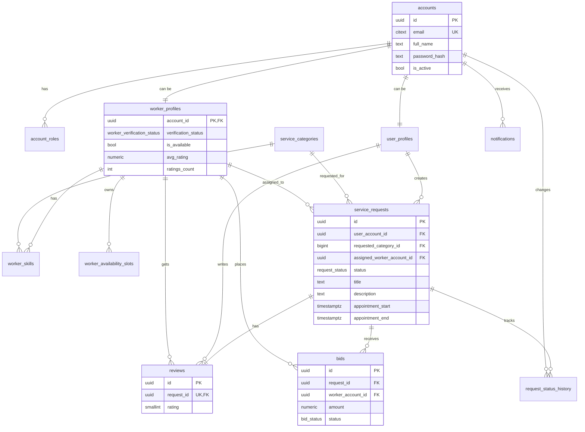

# WorkHire ER Diagram

```mermaid
erDiagram
    accounts ||--o{ account_roles : has
    accounts ||--|| user_profiles : "can be"
    accounts ||--|| worker_profiles : "can be"

    worker_profiles ||--o{ worker_skills : has
    service_categories ||--o{ worker_skills : classifies

    worker_profiles ||--o{ worker_availability_slots : owns

    user_profiles ||--o{ service_requests : creates
    service_categories ||--o{ service_requests : requested_for
    worker_profiles ||--o{ service_requests : assigned_to

    service_requests ||--o{ bids : receives
    worker_profiles ||--o{ bids : places

    service_requests ||--|| reviews : has
    user_profiles ||--o{ reviews : writes
    worker_profiles ||--o{ reviews : gets

    service_requests ||--o{ request_status_history : tracks
    accounts ||--o{ request_status_history : changes

    accounts ||--o{ notifications : receives

    accounts {
      uuid id PK
      citext email UK
      text full_name
      text password_hash
      bool is_active
    }

    worker_profiles {
      uuid account_id PK, FK
      worker_verification_status verification_status
      bool is_available
      numeric avg_rating
      int ratings_count
    }

    service_requests {
      uuid id PK
      uuid user_account_id FK
      bigint requested_category_id FK
      uuid assigned_worker_account_id FK
      request_status status
      text title
      text description
      timestamptz appointment_start
      timestamptz appointment_end
    }

    bids {
      uuid id PK
      uuid request_id FK
      uuid worker_account_id FK
      numeric amount
      bid_status status
    }

    reviews {
      uuid id PK
      uuid request_id UK, FK
      smallint rating
    }
```
